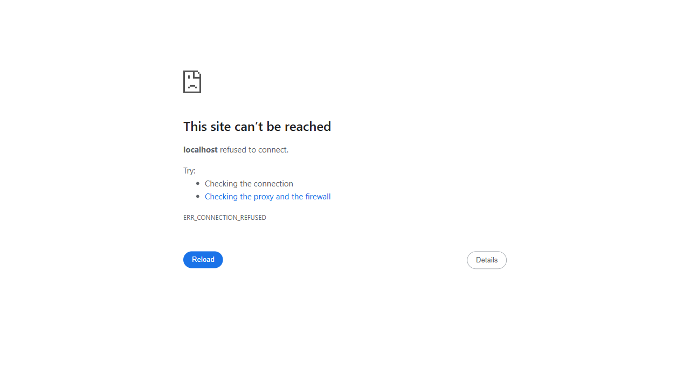

# Generic Browser Test Summary

**Test**: Generic Browser Test
**Timestamp**: 2025-08-02T06:42:20.459Z
**Success**: ❌ FAIL
**URL**: http://localhost:3000

## Test Steps
### Step 1: Opening browser at: http://localhost:3000
- **Status**: ✅ Success
- **Time**: 2025-08-02T06:42:20.853Z

### Step 1.1: ❌ Failed to connect to http://localhost:3000 after 3382ms
- **Status**: ❌ Failed
- **Time**: 2025-08-02T06:42:24.235Z

### Step 1.2: Error: page.goto: net::ERR_CONNECTION_REFUSED at http://localhost:3000/
Call log:
  - navigating to "http://localhost:3000/", waiting until "networkidle"

- **Status**: ❌ Failed
- **Time**: 2025-08-02T06:42:24.236Z

### Step ERROR: Test failed: Server not running or unreachable at http://localhost:3000. page.goto: net::ERR_CONNECTION_REFUSED at http://localhost:3000/
Call log:
  - navigating to "http://localhost:3000/", waiting until "networkidle"

- **Status**: ❌ Failed
- **Time**: 2025-08-02T06:42:24.237Z

### Step ERROR-CAPTURE: Error screenshot captured
- **Status**: ✅ Success
- **Time**: 2025-08-02T06:42:24.353Z

## Screenshots
- 

## Console Activity Summary
- **Total Console Messages**: 0
- **Errors**: 0
- **Network Requests**: 1

❌ **Test Failed**: Server not running or unreachable at http://localhost:3000. page.goto: net::ERR_CONNECTION_REFUSED at http://localhost:3000/
Call log:
  - navigating to "http://localhost:3000/", waiting until "networkidle"

## Files Generated
- `test-results.json` - Complete test execution data
- `console-logs.json` - Browser console messages
- `network-events.json` - Network requests/responses
- `session-summary.md` - This summary file
- `error-screenshot.png` - Screenshot

This test provides a simple way to open the application in a browser for manual testing and debugging.
